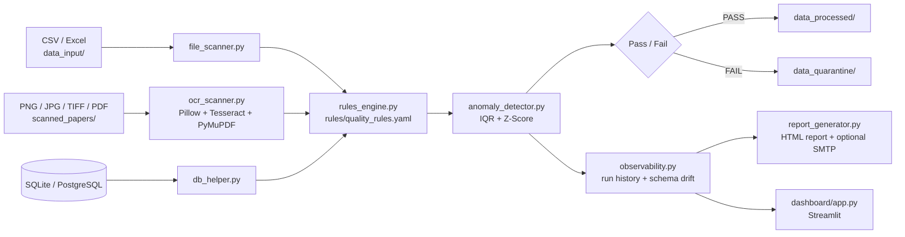

# Enterprise Multi-Source Data Quality & OCR Observability Pipeline

مشروع Data Engineering متكامل لفحص جودة البيانات من ثلاثة مصادر:

1. قواعد البيانات: SQLite / PostgreSQL.
2. الملفات الرقمية: CSV / Excel.
3. المستندات الممسوحة ضوئياً: PNG / JPG / TIFF / PDF عبر Tesseract OCR.

الهدف هو تحويل مصادر مختلفة إلى نتائج Quality موحدة، اكتشاف الأخطاء والشذوذ، عزل المصادر غير السليمة، وإنتاج تقرير HTML تفاعلي مع إمكانية إرساله بالبريد.

---

## Architecture



| Layer | Files | Responsibility |
|---|---|---|
| Ingestion | `file_scanner.py`, `ocr_scanner.py`, `ocr_extractor.py`, `db_helper.py` | قراءة CSV/Excel والصور/PDF (OCR) وجداول قواعد البيانات إلى DataFrame |
| Rules Engine | `rules_engine.py`, `rules/quality_rules.yaml` | قواعد قابلة للتعديل من YAML: `not_null`, `unique`, `range`, `regex`, `date` + حدود Missing/Duplicate |
| Anomaly Detection | `anomaly_detector.py` | IQR و Z-Score والقيم السالبة وجودة OCR |
| Quarantine | `main.py` | نقل الملفات الفاشلة إلى `data_quarantine/` وعدم حذف أي شيء |
| Observability | `observability.py` | سجل التشغيلات (SQLite) واكتشاف Schema Drift |
| Reporting | `report_generator.py` | تقرير HTML تفاعلي + بريد SMTP اختياري |
| Dashboard | `dashboard/app.py` | لوحة Streamlit: الجودة عبر الزمن، آخر Run، Schema Drift |

---

## 1. المتطلبات

- Python 3.10 أو أحدث.
- Tesseract OCR مثبت على الجهاز.
- PostgreSQL فقط إذا أردت استخدام PostgreSQL؛ SQLite يعمل بدون خادم.
- Windows / Linux / macOS.

---

## 2. تثبيت Python Dependencies

من داخل مجلد المشروع:

```bash
python -m venv .venv
```

Windows:

```bash
.venv\Scripts\activate
```

Linux/macOS:

```bash
source .venv/bin/activate
```

ثم:

```bash
python -m pip install --upgrade pip
pip install -r requirements.txt
```

---

# 3. تثبيت Tesseract OCR

## Windows

قم بتثبيت Tesseract OCR من المثبت المناسب لنظام Windows.

بعد التثبيت، المسار الشائع هو:

```text
C:\Program Files\Tesseract-OCR\tesseract.exe
```

ثم انسخ `.env.example` إلى `.env` وضع:

```env
TESSERACT_CMD=C:\Program Files\Tesseract-OCR\tesseract.exe
```

إذا كان المسار يحتوي على مسافات فلا تحتاج إلى وضع علامات اقتباس داخل `.env` في هذه الحالة.

للتأكد من التثبيت:

```bash
tesseract --version
```

إذا ظهر أن الأمر غير معروف، استخدم `TESSERACT_CMD` في `.env`.

---

## 4. اللغة العربية في Tesseract

إذا كانت المستندات تحتوي على العربية والإنجليزية، يجب أن تكون ملفات اللغة العربية موجودة في Tesseract.

بعد التأكد من وجود `ara`، استخدم:

```env
OCR_LANG=ara+eng
```

أما المستندات الإنجليزية فقط:

```env
OCR_LANG=eng
```

يمكن اختبار اللغات:

```bash
tesseract --list-langs
```

ويجب أن يظهر مثلاً:

```text
eng
ara
```

---

# 5. إعداد المشروع

انسخ:

```text
.env.example
```

إلى:

```text
.env
```

ثم عدّل القيم المطلوبة.

---

# 6. SQLite

SQLite هو الوضع الافتراضي.

```env
DATABASE_TYPE=sqlite
SQLITE_DB_PATH=enterprise_quality.db
```

لن تحتاج إلى تشغيل أي خدمة خارجية.

---

# 7. PostgreSQL

إذا أردت PostgreSQL:

```env
DATABASE_TYPE=postgresql
POSTGRES_HOST=localhost
POSTGRES_PORT=5432
POSTGRES_DB=data_quality
POSTGRES_USER=postgres
POSTGRES_PASSWORD=YOUR_PASSWORD
```

ولفحص جداول محددة:

```env
DB_TABLES=customers,orders,payments
```

إذا تركت:

```env
DB_TABLES=
```

سيكتشف النظام جداول `public` تلقائياً في PostgreSQL.

---

# 8. هيكل المشروع

```text
data_quality_pipeline/
├── main.py                  # نقطة التشغيل
├── config.py                # الإعدادات (من .env)
├── db_helper.py
├── file_scanner.py
├── ocr_scanner.py
├── ocr_extractor.py
├── rules_engine.py
├── anomaly_detector.py
├── observability.py
├── report_generator.py
├── create_dummy_data.py     # بيانات تجريبية
├── rules/quality_rules.yaml
├── dashboard/app.py
├── tests/test_enterprise.py
├── .github/workflows/ci.yml
├── requirements.txt
├── .env.example
├── .gitignore
├── LICENSE
│
├── data_input/              # (المحتوى غير مرفوع إلى Git)
├── scanned_papers/
├── data_processed/
├── data_quarantine/
└── reports/
```

بعد أول تشغيل ستظهر أيضاً:

```text
enterprise_quality.db
observability.db
```

---

# 9. إنشاء بيانات تجريبية

نفذ:

```bash
python create_dummy_data.py
```

سيتم إنشاء:

- CSV تجريبي.
- Excel تجريبي.
- SQLite table.
- PNG OCR.
- PDF OCR إذا كانت PyMuPDF مثبتة.

البيانات التجريبية تحتوي عمداً على مشاكل مثل:

- Duplicate rows.
- Missing values.
- Invalid text.
- Negative amount.
- Extreme outlier.
- OCR test values.

---

# 10. تشغيل الـ Pipeline

بعد إنشاء البيانات:

```bash
python main.py
```

التشغيل يمر بالمراحل:

```text
CSV / Excel
    ↓
File Scanner
    ↓
Anomaly Detector

Scanned Image / PDF
    ↓
Pillow
    ↓
Tesseract OCR
    ↓
OCR DataFrame
    ↓
Anomaly Detector

SQLite / PostgreSQL
    ↓
DB Helper
    ↓
Pandas DataFrame
    ↓
Anomaly Detector

كل النتائج
    ↓
HTML Report
    ↓
اختياري: SMTP Email
```

---

# 11. قواعد جودة البيانات

المشروع يطبق عدة مؤشرات:

## Missing Values

يحسب:

```text
missing cells
missing rate
```

## Duplicate Rows

يكتشف الصفوف المكررة بالكامل.

## Numeric Outliers

يستخدم:

- IQR
- Z-Score

القيم الافتراضية:

```env
Z_SCORE_THRESHOLD=3.0
IQR_MULTIPLIER=1.5
```

## Negative Values

يتم التنبيه للقيم السالبة في الأعمدة التي تبدو مالية أو كمية بناءً على اسم العمود، مثل:

```text
amount
price
cost
quantity
total
salary
```

## OCR Confidence

يتم حساب متوسط confidence من Tesseract.

مثلاً:

```text
OCR Confidence = 82.5%
```

إذا كان أقل من:

```env
OCR_MIN_CONFIDENCE=45
```

يتم تسجيل مشكلة جودة OCR.

---

# 12. Data Quarantine

المشروع لا يحذف الملفات.

عند وجود فشل حرج يتم نقل الملف إلى:

```text
data_quarantine/
```

أما المصدر الذي اجتاز الفحص فيتم نقله إلى:

```text
data_processed/
```

بالنسبة لقاعدة البيانات، لا يتم تعديل الصفوف الأصلية. بدلاً من ذلك يتم إنشاء CSV للصفوف الشاذة داخل:

```text
data_quarantine/
```

---

# 13. OCR Architecture

الـ OCR pipeline هو:

```text
PNG/JPG/TIFF
      │
      ▼
    Pillow
      │
      ├── Grayscale
      ├── Autocontrast
      ├── Sharpen
      └── Resize
      │
      ▼
  Tesseract OCR
      │
      ├── Text
      └── Confidence
      │
      ▼
Pandas DataFrame
      │
      ▼
Quality Engine
```

PDF:

```text
PDF
 ↓
PyMuPDF
 ↓
Page Image
 ↓
Pillow
 ↓
Tesseract
 ↓
DataFrame
```

---

# 14. SMTP Email

الإرسال معطل افتراضياً:

```env
SMTP_ENABLED=false
```

لتفعيله:

```env
SMTP_ENABLED=true
SMTP_HOST=smtp.gmail.com
SMTP_PORT=587
SMTP_USERNAME=your_email@gmail.com
SMTP_PASSWORD=your_app_password
EMAIL_FROM=your_email@gmail.com
EMAIL_TO=receiver@example.com
```

إذا كنت تستخدم Gmail، استخدم App Password بدلاً من كلمة مرور الحساب الرئيسية عند تفعيل المصادقة المناسبة.

المشروع يستخدم:

```python
smtplib
```

ولا يعتمد على API مدفوعة.

---

# 15. التقرير

بعد التشغيل سيظهر ملف داخل:

```text
reports/
```

مثال:

```text
quality_report_20260922_193000.html
```

التقرير يحتوي على:

- إجمالي المصادر.
- PASS.
- WARN.
- FAIL.
- متوسط الجودة.
- جدول المصادر.
- OCR Confidence.
- تفاصيل قواعد الفشل.
- البحث داخل النتائج.

---

# 16. ملاحظات Production

هذا المشروع مصمم كأساس Enterprise قابل للتوسع.

في بيئة إنتاج حقيقية يمكن إضافة:

- Airflow / Prefect للتنسيق الدوري.
- Great Expectations أو Soda لقواعد Data Quality متقدمة.
- PostgreSQL production cluster.
- Object Storage.
- Structured logging.
- OpenTelemetry.
- Prometheus/Grafana.
- Data lineage.
- Schema registry.
- Retry policies.
- Dead-letter/quarantine queues.
- Unit/Integration tests.
- Docker/Kubernetes.
- CI/CD.

هذه الإضافات ليست مطلوبة لتشغيل النسخة الحالية.

---

# 17. الأمان

لا تضع كلمات المرور داخل ملفات Python.

استخدم `.env` أو Secret Manager في الإنتاج.

لا ترفع:

```text
.env
*.db
data_quarantine/
```

إلى Git.

---

# 18. الاختبارات ولوحة التحكم

```bash
python -m pytest -q
streamlit run dashboard/app.py
```

ملف `.gitignore` مرفق بالمشروع ويستثني `.env` وقواعد البيانات ومحتوى مجلدات البيانات والتقارير مع الإبقاء على هيكل المجلدات عبر `.gitkeep`.

---

# 19. Troubleshooting

## ModuleNotFoundError

نفذ:

```bash
pip install -r requirements.txt
```

## pytesseract لا يجد Tesseract

حدد:

```env
TESSERACT_CMD=C:\Program Files\Tesseract-OCR\tesseract.exe
```

## PDF لا يعمل

تأكد من:

```bash
pip install PyMuPDF
```

## OCR العربي ضعيف

تأكد أن:

```bash
tesseract --list-langs
```

يحتوي على:

```text
ara
```

ثم:

```env
OCR_LANG=ara+eng
```

## PostgreSQL connection error

تأكد من:

- PostgreSQL يعمل.
- Host صحيح.
- Port صحيح.
- Database موجودة.
- Username/password صحيحان.
- Firewall يسمح بالاتصال.

---

# 20. التشغيل الكامل لأول مرة

```bash
python -m venv .venv
```

Windows:

```bash
.venv\Scripts\activate
```

ثم:

```bash
pip install -r requirements.txt
```

ثم أنشئ `.env` من `.env.example`، واضبط Tesseract.

ثم:

```bash
python create_dummy_data.py
```

وأخيراً:

```bash
python main.py
```

افتح أحدث ملف داخل:

```text
reports/
```

لرؤية التقرير.

---

## ملاحظة تصميم مهمة

النظام لا يفترض أن OCR صحيح دائماً. لذلك يتم الاحتفاظ بثلاثة مستويات منفصلة من المراقبة:

1. هل تم فتح المصدر؟
2. هل تم استخراج البيانات؟
3. هل البيانات المستخرجة ذات جودة مقبولة؟

وهذا يمنع اعتبار نجاح قراءة الملف نجاحاً تلقائياً لجودة البيانات.
